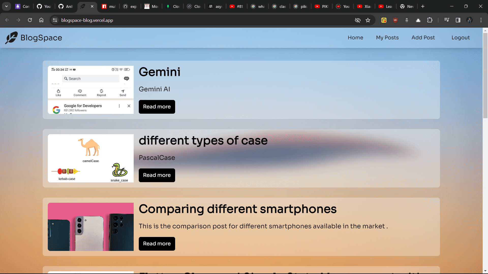
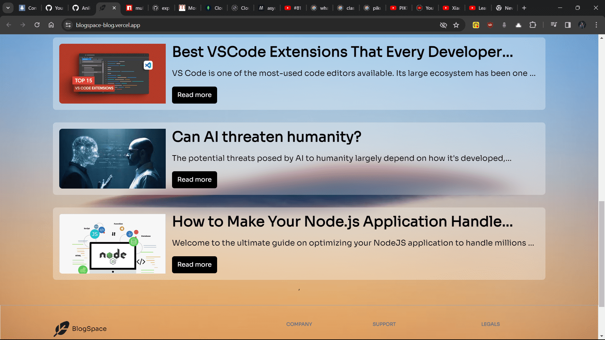
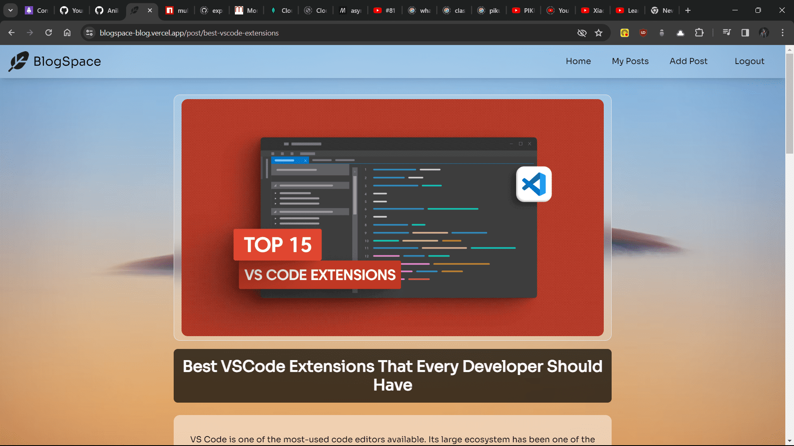
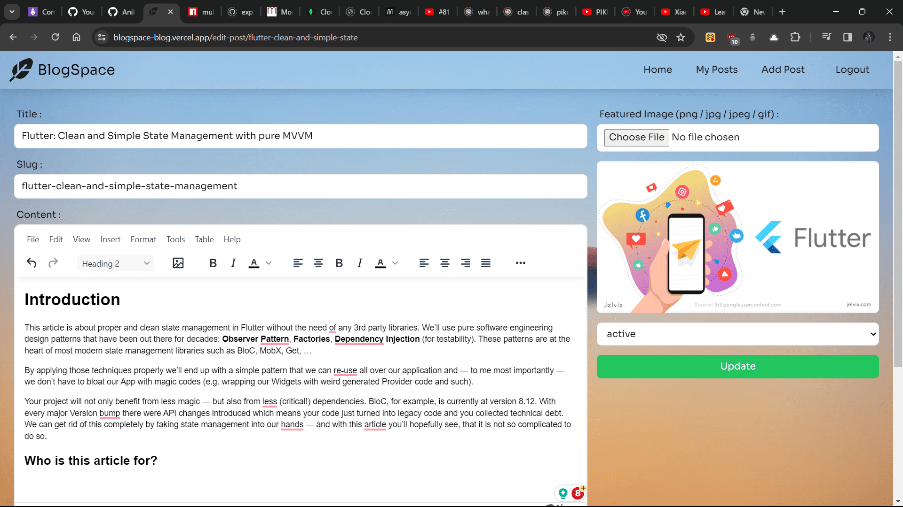

# 📝 BlogSpace

## 🚀 A blog web app built with React and Appwrite

<br/>

### Home Page


### Home Page


### Blog Page


### Post Page


<br/>

## 📖 Description

BlogSpace is a blog web application built with React (Vite) and Appwrite. It allows users to create, read, update, and delete blog posts anonymously. The application uses Appwrite's authentication, database, and storage services. The application is deployed on Vercel.

<br/>

## 🛠️ Installation

To install the project, follow these steps:

1. Clone the repository: `git clone https://github.com/AnikAdhikari7/BlogSpace.git`
2. Navigate into the directory: `cd BlogSpace`
3. Install the dependencies: `npm install`

<br/>

## 🎮 Usage

To run the project, use the command:
```bash
npm run dev
```
To build the project, use the command:
```bash
npm run build
```

<br/>

## 🤝 Contributing

Contributions are welcome! For major changes, please open an issue first to discuss what you would like to change.

<br/>

## 📜 License

This project is licensed under the MIT License - see the LICENSE.md file for details.

<br/>

## 📞 Contact

If you have any questions, feel free to reach out to me at developwithanik@gmail.com.
